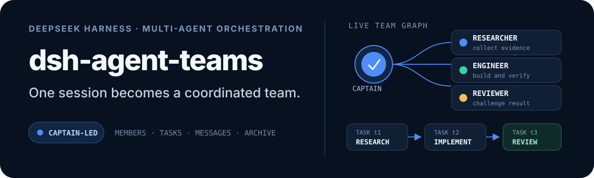

<p align="right">
  <strong>English</strong> · <a href="./README_ZH.md">简体中文</a>
</p>

<p align="center">
  
</p>

<p align="center">
  <a href="https://dshfind.com/en/plugins/NanmiCoder/dsh-agent-teams?ref=badge"></a>
  <a href="https://dshfind.com/en/plugins/NanmiCoder/dsh-agent-teams?ref=badge"></a>
  <a href="https://dshfind.com/en/plugins/NanmiCoder/dsh-agent-teams?ref=badge"></a>
</p>

<p align="center">
  <a href="https://www.npmjs.com/package/@nanmicoder/dsh-agent-teams"></a>
  <a href="./LICENSE"></a>
  <a href="./cordis.patch.yml"></a>
</p>

## One prompt. A working team.

`dsh-agent-teams` turns the current DeepSeek Harness session into a captain that can assemble durable sub-agents, split a goal into dependency-aware tasks, and coordinate work through direct messages.

Ask in natural language. The plugin provides the team protocol, eleven coordination tools, persistent state, an automatic shared-task scheduler, and a live Web UI—without requiring a separate workflow engine.

<p align="center">
  
</p>

## Releases

[v0.1.16-rc.1](./release-notes/v0.1.16-rc.1.md) is the release candidate for the npm `next` channel: a shared host adapter, exact compatibility matrix, real-host acceptance and release gates. Check [GitHub Releases](https://github.com/NanmiCoder/dsh-agent-teams/releases) for release availability and history.

## Why AgentTeams?

| Capability | What it changes |
| --- | --- |
| **Captain-led delegation** | The current session creates the team, assigns roles, and consolidates the final result. |
| **Durable members** | Members are continuable DSH sub-agents that can be woken for focused follow-up turns. |
| **Dependency-aware tasks** | Tasks move through explicit states and cannot be claimed before their dependencies finish. |
| **Automatic reuse and safe takeover** | Idle members claim the next ready task; reassignment revokes stale attempts before new work starts, and cold recovery retries stranded open attempts. |
| **Direct messaging** | Members send durable mailbox messages directly to teammates or the captain—no relay required. |
| **Live activity panel** | The Web UI combines segmented progress, a collapsible roster, and an interactive task DAG; running tasks show the member's model, and completed archives retain their full member and task history. |
| **Plan before execution** | Normal `/agent-teams` runs stage an unspawned roster and DAG first. The Web panel uses the host model catalog for member routes. Returning to chat stops the planning turn, asks what should change, and revises the same draft; discarding archives the draft, aborts the turn, and explicitly prevents automatic recreation. Only **Approve & Run** creates members and starts scheduling. |
| **Quality gates** | Opt-in quality tasks support requirements → implementation → verification → review → integration contracts, automatic repair/re-review, and explicit resume. Scope control is a completion-time audit, not host write interception. See [docs/quality-gates.md](./docs/quality-gates.md). |

The conversation card and activity panel use Harness's official locale service. They follow live language changes between English and Simplified Chinese—including status labels, dynamic summaries, controls, archive markers, and accessibility text—without a page reload or a separate plugin setting.

## Install and choose versions

> [!IMPORTANT]
> **0.1.16-rc.1 is a prerelease on the `next` track.** Use the exact version below for the supported 0.1.2 hosts. Plugin 0.1.15 targets Alpha.2; do not use a mutable `latest` tag as a compatibility guarantee. Check the actual running host and profile before updating either side.

| Harness host | Candidate track | Installation rule |
| --- | --- | --- |
| **0.1.2-rc.1** | Default acceptance target | There is currently no GA host. RC is still a prerelease; ordinary users should not have to follow Alpha. |
| **0.1.2-alpha.5** | Opt-in preview | Select the exact version and lock the entire host dependency cohort. |
| **0.1.2-alpha.2** | Retained legacy preview | Pinning the CLI alone can still resolve rc.1 transitive dependencies. |
| Other versions, source HEAD, embedded Desktop cores | Outside the current matrix | Keep a known working exact pair or complete acceptance before adding a target. |

[compatibility.json](./compatibility.json) is the single source for development, PR checks and release gates. Plugin prereleases use `next`. Unsuffixed versions may use `latest` only after the recommended host and full supported matrix pass. Harness dist-tags belong to upstream; this project cannot change them, so installation instructions use exact versions.

### Ordinary users: keep a matching host and plugin

The recommended host installation target is:

```sh
npm install --global @deepseek-ai/dsh@0.1.2-rc.1
dsh --version
```

Once the release is available, install the exact plugin version into the profile you actually use (`web` below):

```sh
dsh plugin --profile web add --save-exact @nanmicoder/dsh-agent-teams@0.1.16-rc.1
```

Restart the actual Harness process after changing either side and refresh the browser. Updating a global CLI does not replace an embedded Desktop core or another source checkout. For an unpublished checkout, use the source build below.

An exact npm CLI version can still contain broad transitive dependencies. Preserve a verified lockfile and inspect the actual installation. Do not delete credentials or `.agent-teams` data to address a version mismatch.

### Build and verify this candidate

In a checkout containing this change:

```sh
pnpm install --frozen-lockfile
pnpm typecheck
pnpm build
pnpm verify
pnpm pack --out ./agent-teams-candidate.tgz
```

Inspect the actual host, then install the artifact into a separate test profile:

```sh
node scripts/doctor.mjs --host-root "/actual/host/package/directory" --json
dsh plugin --profile agent-teams-preview add --save-exact /absolute/path/agent-teams-candidate.tgz
node scripts/doctor.mjs --host-root "/actual/host/package/directory" --profile-root "/actual/test/profile/directory" --json
dsh --profile agent-teams-preview --dump-config
dsh web --profile agent-teams-preview
```

The doctor checks the DSH dependency cohort, duplicate runtime identities and the profile's plugin version. It reads package metadata without reading credentials or changing configuration. Passing it does not replace team, task and UI acceptance. Rebuild, repack and restart after source changes.

### Developers: explicitly test Alpha

Choose an exact Alpha version; `^0.1.2-alpha.2` does not mean “Alpha.2 only.” Development uses exact rc.1 packages, cohort-wide `pnpm.overrides` and a frozen lockfile. The runtime runner creates separate dependency cohorts, profiles and workspaces for Alpha.2, Alpha.5 and rc.1, installs the same candidate tgz, and checks actual resolution.

```sh
node scripts/harness-runtime-verify.mjs \
  --host-version 0.1.2-alpha.2 \
  --artifact ./agent-teams-candidate.tgz \
  --report-dir /tmp/agent-teams-alpha2-check
```

This developer command downloads the host into temporary directories without modifying existing user profiles. It uses deterministic model responses with the real CLI, plugin, sessions, tools and subagents. See the [maintenance workflow](./docs/maintenance-workflow.md) for coverage and release requirements.

### Retaining an older host / rollback

For the historical Harness `0.1.0-rc.8` + plugin `0.1.14` pair, pin both sides. This is not a compatibility claim for every older RC. Keep another already verified older pair until a complete migration is ready. Historical [Alpha.2 compatibility](./docs/alpha2-compatibility.md) and [acceptance](./docs/alpha2-release-acceptance.md) reports describe those specific releases, not the current matrix.

Then ask for a team directly:

> Use AgentTeams to review the commits after v0.5.3 from performance, security, and product perspectives. Return one consolidated report.

## How it works

1. The current session creates a team and becomes its captain.
2. The captain adds role-specific members backed by continuable sub-agents.
3. The goal becomes tasks with owners and explicit dependencies.
4. The shared scheduler uses real `running / idle / ready` state to atomically claim one ready task per idle member and wake it. An interrupted resident attempt stays parked and can resume through a direct message without losing its capability; after a cold process restart, the scheduler retries stranded open work with a fresh attempt.
5. Members update with the current `attempt_id`; reassignment or captain takeover revokes the old attempt and waits for the old worker to quiesce before a new attempt starts.
6. The captain presents the combined result, then archives the complete team record.

Team state is stored under `<workspace>/.agent-teams/`; the Web panel reads that disk truth and combines it with live sub-agent activity.

Member creation is zero-interaction by default: a member on the captain's current LLM route snapshots that provider, model, and reasoning effort, while a member on a requested alternative route snapshots the target model's default effort; later continuations restore the resolved snapshot. Only an explicit heterogeneous-team request (for example, “backend on provider A/model X, frontend on provider B/model Y”) supplies a member-specific `provider` + `model`; there is no per-member model or reasoning prompt.

## Slash command

No “use AgentTeams” phrasing required. The plugin registers the
closed-namespace `/agent-teams` host command, so the Web GUI slash menu shows
an `agent-teams` placeholder with an input hint: pick it (or type the
command), describe the goal, and press Enter.

```
/agent-teams research the pricing pages of three competitors
```

The command pipeline claims the line, then preserves that exact input as an
ordinary user follow-up so it remains visible in the main chat. The gesture
boundary adds the deterministic activation directive at pre-step, so the
captain protocol still starts immediately. The invocation is also durably
logged (`command/run` / `command/done`).

Surfaces without command adjudication (for example the headless CLI) get the
same deterministic activation through a gesture boundary: any genuine user
message starting with `/agent-teams` activates the protocol for the rest of
the text. Mid-sentence mentions stay ordinary prose.

## Configuration

Defaults work without extra setup. A trusted profile can override member behavior:

```yaml
- id: agent-teams
  config:
    stateDir: .agent-teams
    memberProvider: spawn
    memberModel: deepseek-v4
    memberMaxDepth: 1
    maxMembers: 8
```

`memberProvider` is the sub-agent runtime backend (`spawn` / `fork`), not an LLM provider. Cross-LLM-provider routing uses the optional `provider` + `model` fields of `agent_teams_add_member`; `memberModel` is only a model default for all members. A member on the captain's current provider/model inherits the captain's reasoning effort, while a changed provider or model automatically uses the target model's default. To request a particular effort, pass the optional `reasoning_effort` field — one of the target model's supported effort ids, or `"default"` to force the model's own default.

`slashCommand: false` disables the deterministic `/agent-teams` activation surfaces (slash command and gesture boundary), leaving the natural-language trigger as the only entry point.

## Boundaries

- One captain leads one active team at a time.
- Idle members with no open task are automatically reused for ready work. An idle member that still owns an open attempt is parked until messaged or explicitly reassigned; messages that cannot be delivered live remain durable and are retried at a later status boundary.
- State is file-backed and serialized within one DSH process; concurrent processes editing the same team are not coordinated.
- The activity panel reports persisted state as-is. Models may occasionally finish work without performing the expected task-state update.

See [docs/usage.md](./docs/usage.md) for the full tool reference, state model, Web UI behavior, configuration, and known limits.

## Plugin development Skill

Community upgrade, audit, benchmark, testing and release skills are vendored with a pinned source revision. See [skills/README.md](./skills/README.md) for local rules and [CONTRIBUTING.md](./CONTRIBUTING.md) for the contribution workflow.

The repository also ships the open Agent Skills package [`dsh-plugin-development`](./skills/dsh-plugin-development/SKILL.md):

```sh
npx skills add NanmiCoder/dsh-agent-teams --skill dsh-plugin-development
```

## Documentation

| Guide | Covers |
| --- | --- |
| [Usage](./docs/usage.md) | Architecture, UI behavior, tools, configuration, limits, and validation |
| [Verification](./docs/verification-guide.md) | Offline, composition, real e2e, and GUI verification |
| [Plugin development](./docs/developing-dsh-plugins.md) | Human-readable guide built from this plugin |
| [README writing](./docs/readme-writing-guide.md) | Repository documentation conventions |

## Development

```sh
pnpm install
pnpm build
pnpm verify
```

## Named multi-role profiles

Configure one or more complete team profiles in `cordis.patch.yml`. A profile always supplies the roster (independent provider/model/role/reasoning effort). Set `taskPlanning: captain` when the Captain should derive the DAG from the user's goal; omit it or set `taskPlanning: seed` to keep a fixed template workflow:

```yaml
profiles:
  demo-delivery:
    description: Ship a small feature
    protocol: Discuss requirements, review, test, then prepare release; do not deploy automatically.
    members:
      - name: analyst
        model: gpt-5.6-sol
        role: Analyze requirements
      - name: implementer
        model: gpt-5.6-terra
        role: Implement the approved solution
    tasks:
      - id: requirements
        subject: Requirements discussion
        assignee: analyst
      - id: implementation
        subject: Implement solution
        assignee: implementer
        dependencies: [requirements]
```

Use an explicit profile flag: `/agent-teams --profile demo-delivery implement the feature`. The first ordinary token is never treated as an implicit profile. Normal command runs call `agent_teams_create({ profile, approval: "required" })`: the roster and seed/Captain-designed DAG remain staged, no child session is created, and no task is claimed. Edit the plan in the activity panel using the host model catalog, return to chat so the Captain asks what to revise and then atomically updates the same draft, discard it, or click **Approve & Run**. Return/discard actions cancel any planning turn still running; discard also parks model-facing context that forbids silently creating a replacement team. Approval resolves the final provider/model/reasoning choices, atomically spawns the roster, and starts only ready tasks. A running team is stopped from its own panel header through a confirmation dialog rather than from the composer. Direct tool clients may pass `approval: "automatic"` for the legacy immediate path. Failed review/test tasks do not unlock downstream work; automatic repair/review tasks do not depend on the failed review.

## License

[MIT](./LICENSE)
